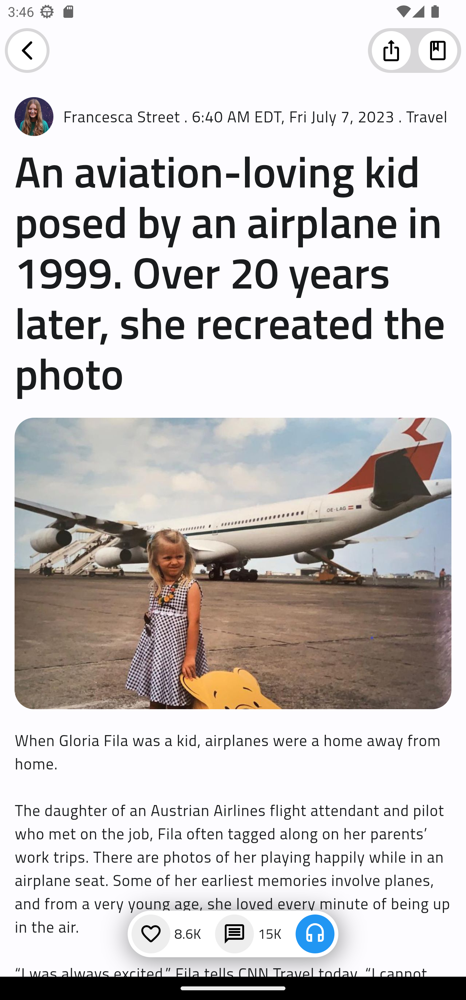

# News App Template

This repository contains a Flutter and Dart-based mobile app project for a News App template. The app provides users with a seamless news browsing experience, offering various screens to cater to their needs. The three main screens included in this project are the Onboarding screen, the Home screen, and the Reading article screen.

## Screenshots

| Onboarding Screen | Home Screen | Reading Article Screen |
|:-----------------:|:-----------:|:----------------------:|
|  |  |  |
|                                         |  |

## Screens

### 1. Onboarding Screen

The Onboarding screen is the initial screen that users encounter when they first open the app. It aims to introduce the app's features and encourage users to explore further. This screen features the following components:

- Image of a journalist, creating a visual connection with the news content.
- Title: A catchy and informative headline to grab the user's attention.
- Description: A brief overview of the app's capabilities and benefits.
- Next button: A prominent button to navigate to the next screen and continue the onboarding process.

### 2. Home Screen

The Home screen serves as the main hub of the app, where users can access various news sections and articles. It offers the following features:

- Breaking News: A horizontal scrolling list that displays the latest breaking news stories, allowing users to stay updated at a glance.
- Categories: A section that provides different news categories, enabling users to explore news specific to their interests.
- Recommended for You: A personalized recommendation section that suggests news articles based on the user's browsing history or preferences.
- Navigation Bar: A bottom navigation bar that allows users to switch between different sections of the app effortlessly.

### 3. Reading Article Screen

The Reading article screen provides a clean and intuitive interface for users to read news articles in detail. It presents the following information:

- Article Content: The main body of the article, formatted for easy reading.
- Title: The headline of the article, capturing the user's attention.
- Author: The name of the article's author or the news source.
- Date: The publication date or last update date of the article.
- Related Articles: A section that suggests related articles for further reading.

## Getting Started

To use this News App template, follow the steps below:

1. Ensure that you have Flutter and Dart installed on your machine. If not, refer to the official Flutter documentation for installation instructions.
2. Clone this repository to your local machine using the command:

git clone https://github.com/ADEL-tec/News_Template.git

4. Open the project in your preferred Flutter development environment (e.g., Android Studio, Visual Studio Code).
5. Run the app on an emulator or a physical device by executing the command:
   
flutter run

Make sure your emulator or device is connected and recognized by Flutter.

## Contributing

Contributions to this News App template are welcome! If you find any bugs, have suggestions, or would like to add new features, please create a new issue or submit a pull request.

When contributing to this project, please follow the established code style and guidelines.

## License

This project is licensed under the [MIT License](LICENSE). Feel free to use and modify the code according to your needs.

## Acknowledgments

- The Flutter and Dart community for their excellent documentation and support.
- Any other individuals or resources that have inspired or helped with this project.

